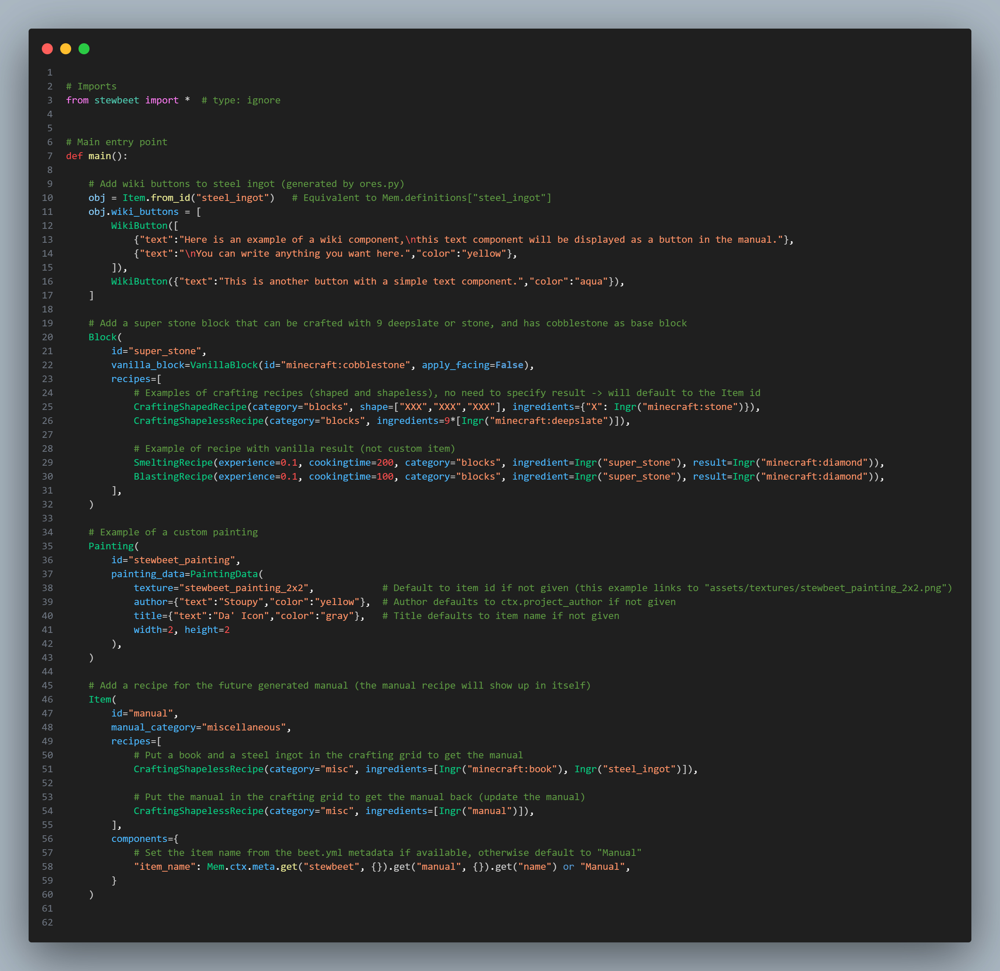

# 🔧 Guide de configuration des définitions StewBeet

## 📖 Définitions
- **Configuration des définitions** : Plugin utilisateur qui crée et enrichit `Mem.definitions`.
- **Définition** : Entrée d'objet typée (`Item`, `Block`, `Painting`, etc.) utilisée par les plugins StewBeet suivants.
- **Mem.definitions** : Registre global où toutes les définitions sont stockées et partagées dans le pipeline.

## 🧪 Exemples
📄 **Fichier d'exemple** : [extensive/src/setup_definitions.py](../../templates/extensive/src/setup_definitions.py) 🔗<br>
📄 **Exemple réel** : [SimplEnergy/src/definitions/setup_main.py](https://github.com/Stoupy51/SimplEnergy/blob/main/src/definitions/setup_main.py) 🔗<br>

## 🔗 Dépendances
- **✅ Requis** : Framework StewBeet (`from stewbeet import *`)
- **✅ Requis** : Contexte Beet (`from beet import Context`)
- **📍 Position** : Doit être appelé tôt dans le pipeline avant les autres plugins qui dépendent des définitions
- **🔄 Intégration** : Fonctionne avec tous les plugins StewBeet qui traitent les définitions d'objets

## 📋 Vue d'ensemble
Les définitions d'objets sont au cœur du framework StewBeet. Elles définissent les objets, blocs, équipements, recettes personnalisés et leurs propriétés en utilisant des classes Python modernes. La configuration des définitions crée une base de données complète de tout le contenu personnalisé que les plugins suivants utilisent pour générer les datapacks et resource packs.

**C'est typiquement le premier plugin créé par l'utilisateur dans le pipeline (après `stewbeet.plugins.initialize`).**

### <u>Démonstration de quelques fonctionnalités</u>

**Définitions d'objets du Template Extensive :**<br>


## 🎯 Objectif
- 🛠️ Définir des objets, blocs et équipements personnalisés en utilisant des classes Python
- ⚙️ Configurer la génération automatique de matériaux (minerais, lingots, outils, armures)
- 📦 Configurer les recettes de craft avec des classes typées
- 🔗 Établir les relations entre les objets et leurs utilisations
- 🏷️ Configurer les noms, lores et catégories des objets
- 🎨 Lier les objets à leurs textures et modèles

## ⚙️ Configuration

### 🎯 Structure de base
Cette structure définit le cycle de vie de votre plugin de définitions : génération, normalisation des métadonnées, post-traitements requis et export de debug optionnel.

```python
from beet import Context
from stewbeet import *

# Importer vos modules de définitions
from .definitions.additions import main as main_additions
from .definitions.ores import main as main_ores

def beet_default(ctx: Context):
    # 1. Générer les matériaux et équipements
    main_ores()
    
    # 2. Générer les disques personnalisés
    generate_custom_records("auto")
    
    # 3. Ajouter les objets, blocs, peintures personnalisés
    main_additions()
    
    # 4. Définir les catégories manquantes
    for item in Mem.definitions.keys():
        obj = Item.from_id(item)
        if not obj.manual_category:
            obj.manual_category = "miscellaneous"
    
    # 5. Ajustements finaux (REQUIS !)
    add_item_model_component(black_list=["excluded_items"])
    add_item_name_and_lore_if_missing()
    add_private_custom_data_for_namespace()
    add_smithed_ignore_vanilla_behaviours_convention()
    set_manual_components(white_list=["item_name", "lore", "custom_name", "damage", "max_damage"])
    
    # 6. Export de débogage (optionnel)
    export_all_definitions_to_json(f"{Mem.ctx.directory}/definitions_debug.json")
```

## 📚 Concepts de base

### 🔩 La base de données Mem.definitions
Toutes les définitions d'objets sont stockées dans `Mem.definitions`, un dictionnaire global qui se remplit lorsque vous créez des instances `Item`, `Block` ou `Painting` :

```python
# Créer un objet l'enregistre automatiquement
item = Item(id="my_item", base_item="minecraft:iron_ingot")

# Y accéder de n'importe où
same_item = Item.from_id("my_item")
assert item is same_item  # C'est le même objet !

# Vérifier le dictionnaire sous-jacent
assert "my_item" in Mem.definitions
```

### 🏗️ Classe Item

Définition des propriétés de la classe `Item` :

#### **Propriétés Item**

| Propriété | Type | Description |
|----------|------|-------------|
| `id` | `str` | **Requis** : Identifiant unique (ex., `"magic_sword"`) |
| `base_item` | `str` | Objet Minecraft de base (défaut : `CUSTOM_ITEM_VANILLA`) |
| `manual_category` | `str \| None` | Catégorie pour l'organisation du manuel en jeu |
| `recipes` | `list[RecipeBase]` | Liste d'objets recette qui créent cet objet |
| `override_model` | `JsonDict \| None` | Override du modèle d'objet auto-généré |
| `hand_model` | `JsonDict \| None` | Modèle utilisé à la place du modèle normal dans la plupart des contextes d'affichage (main, gui, sol, ...) |
| `override_model_contexts` | `list[str] \| None` | Contextes d'affichage gardant le modèle normal quand `hand_model` est défini (défaut : `["none", "fixed"]`, c.-à-d. entités item display et cadres) |
| `wiki_buttons` | `list[WikiButton] \| TextComponent \| None` | Documentation du manuel |
| `components` | `JsonDict` | Composants d'objets Minecraft (sans préfixe `minecraft:`) |

Exemple d'utilisation de la classe `Item` :

```python
from stewbeet import Item, Ingr, CraftingShapedRecipe, WikiButton

item = Item(
    id="magic_sword",                           # Requis : identifiant unique
    base_item="minecraft:iron_sword",           # Objet Minecraft de base (défaut : CUSTOM_ITEM_VANILLA)
    manual_category="equipment",                # Catégorie pour le manuel
    recipes=[                                   # Liste d'objets Recipe
        CraftingShapedRecipe(
            category="equipment",
            shape=["X", "X", "Y"],
            ingredients={"X": Ingr("minecraft:amethyst_shard"), "Y": Ingr("minecraft:stick")}
        )
    ],
    override_model=None,                        # Override du modèle auto-généré
    hand_model=None,                            # Modèle spécial tenu en main
    override_model_contexts=None,               # Contextes gardant le modèle normal quand hand_model est défini
    wiki_buttons=[                              # Boutons de documentation du manuel
        WikiButton({"text": "Une épée puissante", "color": "gold"})
    ],
    components={                                # Composants d'objets Minecraft
        "item_name": {"text": "Épée Magique", "color": "gold"},
        "lore": [{"text": "Inflige des dégâts supplémentaires", "color": "gray"}],
        "max_damage": 500,
        "enchantments": {"minecraft:sharpness": 5},
        "attribute_modifiers": [
            {
                "type": "minecraft:attack_damage",
                "amount": 8,
                "operation": "add_value",
                "slot": "mainhand",
                "id": "minecraft:base_attack_damage"
            }
        ]
    }
)
```

### 🧱 Classe Block

Les blocs personnalisés étendent la classe `Item` avec des propriétés spécifiques aux blocs :

```python
from stewbeet import Block, VanillaBlock, CraftingShapedRecipe, SmeltingRecipe, Ingr

block = Block(
    id="super_stone",
    vanilla_block=VanillaBlock(id="minecraft:cobblestone"),
    manual_category="building",
    recipes=[
        # Aurait pu être shapeless, mais juste pour l'exemple :
        CraftingShapedRecipe(
            category="building",
            shape=["XXX", "XXX", "XXX"],
            ingredients={"X": Ingr("minecraft:stone")}
        ),
        # Plusieurs types de recettes supportés
        SmeltingRecipe(
            experience=0.1,
            cookingtime=200,
            category="building",
            ingredient=Ingr("super_stone"),
            result=Ingr("minecraft:diamond")
        )
    ],
    components={
        # Le nom d'objet, lore et container seront auto-générés si manquants
    }
)
```

#### **Configuration VanillaBlock**

`VanillaBlock` définit l'état de bloc vanilla utilisé par StewBeet comme point d'ancrage d'exécution pour le comportement de votre bloc personnalisé.

```python
@dataclass
class VanillaBlock:
    id: str                                          # Bloc vanilla de base (ex., "minecraft:cobblestone")
    contents: bool = False                           # Pour les blocs utilisant des item frames sans bloc vanilla
    block_facing: Literal[False, "player"] = False   # Rotation du bloc placé selon le joueur
    visual_facing: Literal["none", "player", "item_frame"] = "none"  # Source d'orientation visuelle
```

#### **Configuration NoSilkTouchDrop**

Définit les drops personnalisés quand le bloc est cassé sans toucher de soie :

```python
@dataclass
class NoSilkTouchDrop:
    id: str                     # ID de l'objet à drop (ex., "raw_simplunium")
    count: dict | int = 1       # Nombre de drops : int ou {"min": 1, "max": 3}
```
```python
# Exemple d'utilisation
block = Block(
    id="simplunium_ore",
    vanilla_block=VanillaBlockForOres,
    no_silk_touch_drop=NoSilkTouchDrop(id="raw_simplunium", count={"min": 2, "max": 4})
)

# Ou raccourci
block = Block(
    id="simplunium_ore",
    vanilla_block=VanillaBlockForOres,
    no_silk_touch_drop="raw_simplunium"  # Par défaut count=1
)

# Ou drops dynamiques avec une LootTable beet directe
block = Block(
    id="simplunium_ore",
    vanilla_block=VanillaBlockForOres,
    no_silk_touch_drop=LootTable({
        "pools": [{
            "rolls": 1,
            "entries": [
                {"type": "minecraft:item", "name": "minecraft:raw_iron", "weight": 3},
                {"type": "minecraft:item", "name": "minecraft:iron_nugget", "weight": 7}
            ]
        }]
    })
)
```

#### **Configuration GrowingSeed**

Pour les graines qui poussent avec le temps (comme Stardust Seed de [Stardust Fragment](https://github.com/Stoupy51/StardustFragment)) :

```python
@dataclass
class GrowingSeedLoot:
    id: str                     # ID de l'objet à drop
    rolls: JsonDict | int = 1   # Définition de roll ou nombre
    fortune: JsonDict | None = None  # Modificateur de fortune

@dataclass
class GrowingSeed:
    texture_basename: str       # Nom de base de la texture (ex., "stardust")
    seconds: int                # Temps de croissance en secondes
    planted_on: str             # Bloc sur lequel planter (ex., "diamond_block")
    loots: list[GrowingSeedLoot] | str  # Liste de loots ou chemin de loot table
```
```python
# Exemple d'utilisation
seed = Block(
    id="stardust_seed",
    vanilla_block=VanillaBlock(id="minecraft:wheat"),
    no_silk_touch_drop=NoSilkTouchDrop(id="stardust_fragment", count=1),
    growing_seed=GrowingSeed(
        texture_basename="stardust",
        seconds=480,  # 8 minutes
        planted_on="diamond_block",
        loots=[
            GrowingSeedLoot(
                id="stardust_fragment",
                rolls={"type": "minecraft:uniform", "min": 3, "max": 9},
                fortune={"extra": 0, "probability": 0.5}
            )
        ]
    )
)
```

#### **`on_place` — Commandes de placement personnalisées**

Chaîne optionnelle de commandes Minecraft ajoutées à `{ns}:custom_blocks/{id}/place_secondary`, exécutées **en tant qu'entité item display (ou item frame)** juste après la mise en place complète du bloc :

```python
block = Block(
    id="my_machine",
    vanilla_block=VanillaBlock(id="minecraft:furnace"),
    on_place="tag @s add my_ns.active\nscoreboard players set @s my_ns.energy 0"
)

# Les chaînes multi-lignes fonctionnent aussi
block = Block(
    id="stardust_seed",
    vanilla_block=VanillaBlock(id="minecraft:wheat"),
    on_place=(
        "tag @s add my_ns.seed\n"
        "scoreboard players add @s my_ns.growth_time 0"
    )
)
```

> **Note** : Les commandes s'exécutent en tant qu'item_display, pas en tant que joueur. Utilisez `execute as @p[tag={ns}.placer]` si vous devez cibler le joueur qui place le bloc.

#### **BlockAlternative et BlockHead**

Types de blocs alternatifs pour des méthodes de placement spéciales :

```python
from stewbeet import BlockAlternative, BlockHead

# Utilisant des item frames (ex., pour des machines sans bloc vanilla)
servo = BlockAlternative(
    id="servo_inserter",
    vanilla_block=VanillaBlock(contents=True),  # Pas de bloc vanilla, juste item frame
    manual_category="machines"
)

# Utilisant des têtes de joueur (pour des têtes personnalisées)
custom_head = BlockHead(
    id="stoupy_head",
    vanilla_block=VanillaBlock(id="minecraft:player_head[profile={name:\"Stoupy51\"}]"),
    manual_category="decorations"
)
```

### 🎨 Classe Painting

Peintures personnalisées pour la décoration :

```python
from stewbeet import Painting, PaintingData

painting = Painting(
    id="stewbeet_painting",
    manual_category="decorations",
    painting_data=PaintingData(
        texture="stewbeet_painting_2x2",                # Nom du fichier texture (sans .png)
        author={"text": "Stoupy", "color": "yellow"},   # Par défaut ctx.project_author
        title={"text": "L'Icône", "color": "gray"},     # Par défaut nom de l'objet
        width=2,                                        # Largeur en blocs
        height=2                                        # Hauteur en blocs
    )
)
```

## 🍳 Système de recettes

### 📋 Classes de recettes

StewBeet fournit des classes de recettes typées pour tous les types de recettes Minecraft :

#### **⚔️ Crafting Shaped Recipe**
Utilisez une recette shaped quand la position des ingrédients est importante ; la `shape` associe des symboles aux ingrédients et impose la disposition.

```python
from stewbeet import CraftingShapedRecipe, Ingr

recipe = CraftingShapedRecipe(
    result_count=1,                            # Nombre d'objets produits
    group="tools",                             # Groupement du livre de recettes
    category="equipment",                      # Catégorie du livre de recettes
    shape=["X X", " Y ", "X X"],               # Motif 3x3
    ingredients={
        "X": Ingr("minecraft:iron_ingot"),
        "Y": Ingr("minecraft:stick")
    }
)
```

#### **🎯 Crafting Shapeless Recipe**
Utilisez une recette shapeless quand seule la présence des ingrédients compte, sans tenir compte de leur position dans la grille.

```python
recipe = CraftingShapelessRecipe(
    result_count=4,
    category="building_blocks",
    ingredients=[Ingr("minecraft:oak_wood"), Ingr("minecraft:oak_log"),
                 Ingr("minecraft:oak_log"), Ingr("minecraft:oak_wood")]
    # Peut aussi utiliser : ingredients=(2*[Ingr("minecraft:oak_wood")] + 2*[Ingr("minecraft:oak_log"])
)
```

#### **🔥 Smelting Recipe**
Les recettes de smelting modélisent les transformations de type four avec un temps de cuisson, une récompense XP et une conversion entrée-sortie.

```python
recipe = SmeltingRecipe(
    result_count=1,
    cookingtime=200,        # Ticks (200 = 10 secondes)
    experience=0.7,
    category="misc",
    ingredient=Ingr("ruby_ore"),
    result=Ingr("ruby")
)
```

#### **⚡ Autres types de recettes**
StewBeet fournit des wrappers typés pour les mécaniques de recette vanilla spécialisées afin de configurer chaque comportement explicitement.

```python
# Haut fourneau (cuisson plus rapide)
BlastingRecipe(cookingtime=100, experience=0.7, ...)

# Fumoir (pour la nourriture)
SmokingRecipe(cookingtime=100, experience=0.35, ...)

# Feu de camp
CampfireCookingRecipe(cookingtime=600, experience=0.35, ...)

# Taille de pierre
StonecuttingRecipe(result_count=1, ingredient=Ingr(...), result=Ingr(...))

# Forge transformation
SmithingTransformRecipe(template=Ingr(...), base=Ingr(...), addition=Ingr(...), result=Ingr(...))

# Forge parure
SmithingTrimRecipe(template=Ingr(...), base=Ingr(...), addition=Ingr(...))
```

### 🔄 Helper Ingredient

La fonction `Ingr` crée des spécifications d'ingrédients :

```python
from stewbeet import Ingr

# Objet du namespace local
Ingr("steel_ingot")
# Résultat : {"custom_data": {"your_namespace": {"steel_ingot": True}}}

# Objet Minecraft
Ingr("minecraft:iron_ingot")
# Résultat : {"id": "minecraft:iron_ingot"}

# Objet de datapack externe
Ingr("tin_ingot", ns="mechanization")
# Résultat : {"custom_data": {"mechanization": {"tin_ingot": True}}}

# Utilisation dans les recettes
recipe = CraftingShapedRecipe(
    shape=["XXX", "XYX", "XXX"],
    ingredients={
        "X": Ingr("steel_ingot"),
        "Y": Ingr("minecraft:diamond")
    }
)
```

## 🛠️ Génération de matériaux

### ⚒️ Génération automatique d'équipements

Générez des sets de matériaux complets automatiquement :

```python
# Dans src/definitions/ores.py
from stewbeet import *

def main():
    ORES_CONFIGS: dict[str, EquipmentsConfig | None] = {
        "steel_ingot": EquipmentsConfig(
            equivalent_to=DefaultOre.IRON,          # Stats du matériau de base
            pickaxe_durability=3 * VanillaEquipments.PICKAXE.value[DefaultOre.IRON]["durability"],
            attributes={
                "attack_damage": 1,                  # +1 dégâts pour les armes
                "armor": 0.5,                        # +0.5 armure pour les pièces d'armure  
                "mining_efficiency": 2               # +20% vitesse de minage pour les outils
            }
        ),
        "minecraft:stone": None,    # Auto-détection depuis les textures (ex., stone_stick, stone_rod, etc.)
    }
    
    # Génère : steel_ingot, steel_pickaxe, steel_axe, steel_shovel, 
    # steel_sword, steel_hoe, steel_helmet, steel_chestplate, 
    # steel_leggings, steel_boots, steel_block, raw_steel, raw_steel_block, etc.
    generate_everything_about_these_materials(ORES_CONFIGS)
    
    # Configurer les blocs personnalisés après génération
    # ⚠️ Nous utilisons Block.from_id() pour accéder aux définitions existantes et les modifier
    Block.from_id("steel_block").vanilla_block = VanillaBlock(id="minecraft:iron_block")
    Block.from_id("raw_steel_block").vanilla_block = VanillaBlock(id="minecraft:raw_iron_block")
```

### 🧪 Configuration d'équipement

`EquipmentsConfig` contrôle l'héritage des statistiques de base des familles de matériaux générées et l'application des modificateurs personnalisés sur les outils et armures.

```python
class EquipmentsConfig:
    equivalent_to: DefaultOre                   # Matériau de base (WOOD, STONE, GOLD, IRON, DIAMOND, NETHERITE, COPPER, CHAINMAIL, LEATHER)
    pickaxe_durability: float | int = 0         # Durabilité personnalisée (0 = utiliser équivalent vanilla)
    attributes: dict[str, float] | None = None  # Modificateurs de stats à AJOUTER (pas remplacer)
    ignore_recipes: bool = False                # Ignorer la génération automatique de recettes
```

**Modificateurs d'attributs courants :**
- `"attack_damage": 1.0` -> +1 dégât d'attaque pour les armes (ex., pioche diamant : 5 -> 6)
- `"armor": 0.5` -> +0.5 armure pour chaque pièce d'armure
- `"armor_toughness": 1.0` -> +1 robustesse d'armure pour les pièces d'armure
- `"mining_efficiency": 2` -> +20% vitesse de minage pour les outils
- `"knockback_resistance": 0.1` -> +0.1 résistance au recul (appliqué à l'armure uniquement)

## 📖 Intégration de la documentation

### 📝 Boutons Wiki

Ajoutez de la documentation interactive pour le manuel en jeu :

```python
from stewbeet import Item, WikiButton

item = Item.from_id("steel_ingot")  # Récupérer un objet existant
item.wiki_buttons = [
    WikiButton([
        {"text": "L'acier est une variante plus solide du fer.\n"},
        {"text": "Il offre une meilleure durabilité.", "color": "yellow"}
    ]),
    WikiButton({"text": "Ceci est un autre bouton.", "color": "aqua"})
]
```

### 📚 Objet Manuel

Créez une recette pour le manuel en jeu :

```python
Item(
    id="manual",
    manual_category="miscellaneous",
    recipes=[
        # Craft avec livre + lingot d'acier
        CraftingShapelessRecipe(
            category="misc",
            ingredients=[Ingr("minecraft:book"), Ingr("steel_ingot")]
        ),
        # Mettre à jour le manuel en le craftant à nouveau
        CraftingShapelessRecipe(
            category="misc",
            ingredients=[Ingr("manual")]
        )
    ],
    components={
        "item_name": Mem.ctx.meta.get("stewbeet", {}).get("manual", {}).get("name") or "Manuel"
    }
)
```

## 🎵 Contenu audio

### 🎶 Disques de musique personnalisés

La génération de disques mappe les assets `.ogg` vers les définitions afin de garder sons, objets et références synchronisés automatiquement.

```python
# Auto-génération depuis les fichiers assets/records/*.ogg
generate_custom_records("auto")

# Ou spécifier manuellement
generate_custom_records({
    "my_disc": "Ma Musique Personnalisée.ogg",
    "battle_theme": "Musique de Combat Épique.ogg"
})
```

## 🔧 Fonctions utilitaires

### 🧰 Fonctions helper essentielles

Ces helpers finalisent les définitions pour garantir une sortie cohérente, correctement namespacée, et prête pour les plugins suivants.

```python
# Générer les modèles d'objets pour tous les objets définis
add_item_model_component(black_list=["excluded_items"])

# Ajouter les noms et lores par défaut là où manquants
add_item_name_and_lore_if_missing()

# Ajouter les données de détection de namespace (REQUIS !)
add_private_custom_data_for_namespace()

# Ajouter les données de convention Smithed
add_smithed_ignore_vanilla_behaviours_convention()

# Configurer les composants de survol du manuel
set_manual_components(white_list=["item_name", "lore", "custom_name", "damage", "max_damage"])

# Exporter les définitions pour le débogage
export_all_definitions_to_json(f"{Mem.ctx.directory}/definitions_debug.json")
```

## 🏷️ Catégories d'objets

Catégories courantes pour l'organisation du manuel (mais c'est toujours à vous de décider !) :

| Catégorie         | Description                             |
| ----------------- | --------------------------------------- |
| `"materials"`     | Matériaux bruts, lingots, gemmes        |
| `"equipment"`     | Outils, armes, armures                  |
| `"building"`      | Blocs de construction, blocs décoratifs |
| `"miscellaneous"` | Autres objets, objets spéciaux          |
| `"food"`          | Objets consommables                     |
| `"decorations"`   | Peintures, objets décoratifs            |

## ✨ Fonctionnalités avancées

### 🎨 Intégration de textures
Les objets détectent automatiquement les textures par nom depuis `assets/textures/` :
- `steel_ingot.png` -> objet `steel_ingot`
- `steel_pickaxe.png` -> outil `steel_pickaxe`
- `steel_block.png` -> bloc personnalisé `steel_block`

### 🔗 Accéder aux objets existants

`Item.from_id` permet de récupérer et modifier des définitions déjà déclarées, ce qui facilite une configuration par étapes sans recréer les objets.

```python
# Récupérer un objet existant
item = Item.from_id("my_item")

# Le modifier
item.manual_category = "materials"
item.wiki_buttons = [WikiButton({"text": "Nouvelle info !"})]

# Ajouter une recette
item.recipes.append(CraftingShapelessRecipe(
    category="misc",
    ingredients=[Ingr("something")]
))
```

### 🎨 Exemples de modèles complexes

#### **Motifs de textures reconnus**

StewBeet reconnaît automatiquement les motifs de textures et génère les modèles appropriés :

**Motifs de blocs :**
- **`cube_all`** : Texture unique (ex., `my_block.png`)
- **`cake`** : bottom, side, top, inner (ex., `my_cake_bottom.png`, `my_cake_side.png`, `my_cake_top.png`, `my_cake_inner.png`)
- **`orientable_with_bottom`** : front, bottom, side, top (ex., `furnace_front.png`, `furnace_bottom.png`, `furnace_side.png`, `furnace_top.png`)
- **`cube_bottom_top`** : bottom, side, top (ex., `barrel_bottom.png`, `barrel_side.png`, `barrel_top.png`)
- **`orientable`** : front, side, top (ex., `dropper_front.png`, `dropper_side.png`, `dropper_top.png`)
- **`cube_column`** : end, side (ex., `pillar_end.png`, `pillar_side.png`)

**Motifs d'objets :**
- **`leather_armor`** : Les objets commençant par `leather_` utilisent automatiquement layer1 pour la coloration en overlay
- **`overlay`** : Objets avec texture `_overlay` (ex., `my_item.png` + `my_item_overlay.png` -> layer0 + layer1)
- **`bow_pulling`** : Objets d'arc avec `_pulling_0`, `_pulling_1`, `_pulling_2`, etc. (triés numériquement)
- **`spear_in_hand`** : Lances se terminant par `_spear` + variante de texture `_in_hand` (utilise le changement de contexte d'affichage)

**États alimentés :**
- N'importe quel bloc/objet peut avoir des variantes `_on` (ex., `furnace_front.png` + `furnace_front_on.png`)
- StewBeet génère automatiquement les deux états si des textures `_on` sont détectées

#### **États multiples (On/Off, Facing)**

Exemple du four électrique de SimplEnergy avec états on/off et orientation directionnelle :

```python
from stewbeet import Block, VanillaBlock, CraftingShapedRecipe, Ingr

# Créer le bloc de four électrique
electric_furnace = Block(
    id="electric_furnace",
    vanilla_block=VanillaBlock(
        id="minecraft:furnace",
        block_facing="player"  # Active les variantes directionnelles (nord, est, sud, ouest)
    ),
    manual_category="energy",
    recipes=[
        CraftingShapedRecipe(
            category="misc",
            shape=["LLL", "LML", "III"],
            ingredients={
                "L": Ingr("minecraft:lapis_lazuli"),
                "M": Ingr("machine_block"),
                "I": Ingr("minecraft:iron_block")
            }
        )
    ],
    components={
        "item_name": {"text": "Four Électrique", "color": "aqua"},
        "custom_data": {"energy": {"usage": 20, "max_storage": 1600}}
    }
)

# StewBeet détecte automatiquement les motifs de modèles de blocs depuis les noms de textures :
# Textures requises : electric_furnace_front.png, electric_furnace_side.png, electric_furnace_top.png, electric_furnace_bottom.png
# Optionnel pour l'état on : electric_furnace_front_on.png (les autres côtés peuvent aussi avoir des variantes _on)
# Motif reconnu : "orientable_with_bottom" (front, side, top, bottom)
# Autres motifs supportés : "orientable" (front, side, top), "cube_bottom_top" (bottom, side, top), "cube_column" (end, side)
```

#### **Modèles d'objets animés (Tir à l'arc)**

Exemple avec animations de tir à l'arc :

```python
from stewbeet import Item, Ingr, CraftingShapedRecipe

custom_bow = Item(
    id="super_bow",
    base_item="minecraft:bow",
    manual_category="equipment",
    recipes=[
        CraftingShapedRecipe(
            category="equipment",
            shape=[" XY", "X Y", " XY"],
            ingredients={"X": Ingr("minecraft:stick"), "Y": Ingr("minecraft:string")}
        )
    ],
    components={
        "item_name": {"text": "Super Arc", "color": "gold"},
        "max_damage": 500
    }
)

# StewBeet auto-génère les modèles d'animation de tir et les fichiers JSON item_model :
# Textures requises dans assets/textures/item/ :
# - super_bow.png (texture d'arc de base)
# - super_bow_pulling_0.png (légèrement tiré)
# - super_bow_pulling_1.png (à moitié tiré)  
# - super_bow_pulling_2.png (complètement tiré)
# 
# Fichiers générés :
# - assets/models/item/super_bow_pulling_0.json, super_bow_pulling_1.json, super_bow_pulling_2.json
# - assets/items/super_bow.json (avec condition et range_dispatch pour les états de tir)
```

## 🚨 Bonnes pratiques

### ✅ À faire
- Utilisez les classes `Item`, `Block`, `Painting` pour des définitions propres et typées
- Utilisez `Ingr()` pour toutes les références d'ingrédients
- Appelez les fonctions d'ajustement final à la fin de `beet_default()`
- Organisez les définitions dans des modules séparés (comme `ores.py`, `additions.py`)
- Utilisez des catégories significatives pour l'organisation du manuel
- Définissez `vanilla_block` pour les blocs personnalisés après génération

### ❌ À ne pas faire
- Ne modifiez pas `Mem.definitions` directement (utilisez les classes)
- N'utilisez pas de dictionnaires bruts pour les ingrédients (utilisez `Ingr()`)
- N'oubliez pas d'appeler les fonctions d'ajustement final
- Ne sautez pas la configuration de `vanilla_block` pour les blocs personnalisés

## 🎯 Exemple complet

```python
# src/setup_definitions.py
from beet import Context
from stewbeet import *

from .definitions.additions import main as main_additions
from .definitions.ores import main as main_ores

def beet_default(ctx: Context):
    # 1. Générer les matériaux
    main_ores()
    
    # 2. Générer les disques
    generate_custom_records("auto")
    
    # 3. Ajouter les objets personnalisés
    main_additions()
    
    # 4. Définir les catégories manquantes
    for item_id in Mem.definitions.keys():
        obj = Item.from_id(item_id)
        if not obj.manual_category:
            obj.manual_category = "miscellaneous"
    
    # 5. Ajustements finaux (REQUIS !)
    add_item_model_component()
    add_item_name_and_lore_if_missing()
    add_private_custom_data_for_namespace()
    add_smithed_ignore_vanilla_behaviours_convention()
    set_manual_components(white_list=["item_name", "lore", "custom_name", "damage", "max_damage"])
    
    # 6. Export de débogage
    export_all_definitions_to_json(f"{Mem.ctx.directory}/definitions_debug.json")
```

**🎉 Cette approche moderne crée des définitions d'objets propres et type-safe qui s'intègrent parfaitement avec tous les plugins StewBeet !**<br>
Consultez les exemples réels en haut de cette page pour voir comment ça fonctionne en pratique ! 🚀

