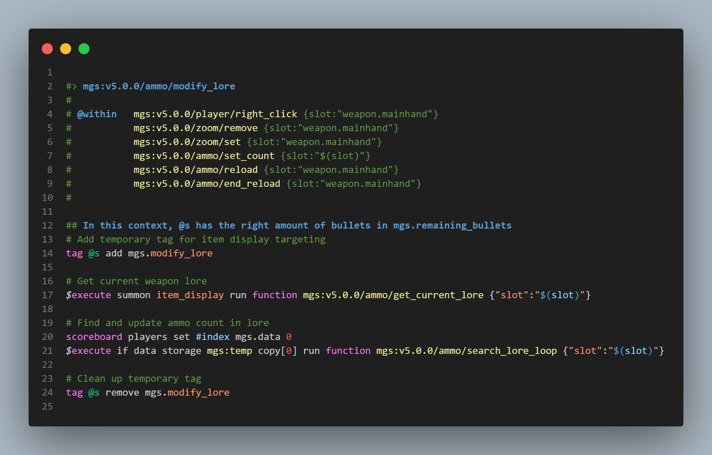
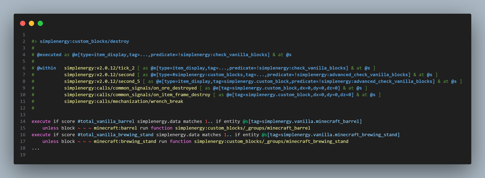

# 📝 stewbeet.plugins.auto.headers

📄 **Source Code**: [`stewbeet/plugins/auto/headers/__init__.py`](../../python_package/stewbeet/plugins/auto/headers/__init__.py) 🔗<br>
📄 **Source Code**: [`stewbeet/plugins/auto/headers/object.py`](../../python_package/stewbeet/plugins/auto/headers/object.py) 🔗<br>
📄 **Source Code**: [`stewbeet/plugins/auto/headers/context_analyzer.py`](../../python_package/stewbeet/plugins/auto/headers/context_analyzer.py) 🔗<br>
📄 **Source Code**: [`stewbeet/plugins/auto/headers/execution_parser.py`](../../python_package/stewbeet/plugins/auto/headers/execution_parser.py) 🔗<br>
📄 **Source Code**: [`stewbeet/plugins/auto/headers/function_analyzer.py`](../../python_package/stewbeet/plugins/auto/headers/function_analyzer.py) 🔗<br>

## 📋 Overview
The `auto.headers` plugin automatically generates documentation headers for mcfunction files.<br>
It analyzes function calls, function tags, advancement rewards, and macro usage to create<br>
comprehensive `@within` documentation that shows which functions, tags, or advancements<br>
call each function, providing clear dependency tracking and usage documentation.<br>

**🎮 Context Analysis**: The plugin intelligently extracts and preserves execution contexts<br>
from `execute` commands (such as `as @e`, `positioned`, `at`, `rotated`, `facing`, etc.)<br>
and automatically determines the execution context for functions based on their callers.

## 🔗 Dependencies
- **✅ Required**: Beet context with functions, function tags, and advancements
- **📍 Position**: Should run after all content generation but before finalization
- **🔧 Optional**: Existing function headers (will be parsed and updated)

### <u>Some Features Showcase</u>

**Example of a function being called by multiple functions with macro arguments:**<br>


**Example of a function being called by multiple functions with different contexts:**<br>


## 🎯 Purpose
- 📝 Automatically generates function documentation headers
- 🔍 Tracks function call relationships and dependencies
- 🏷️ Analyzes function tag memberships and usage
- 🎖️ Monitors advancement reward function calls
- 🔧 Handles macro parameters and scheduling information
- 🎮 **Extracts execution contexts** from `execute` commands (`as`, `at`, `positioned`, `rotated`, `facing`, `in`, `anchored`, `align`)
- 🧠 **Determines function execution contexts** automatically based on caller analysis
- 📊 Creates comprehensive `@within` documentation

## ⚙️ Configuration

### 🎯 Basic Example Configuration
```yaml
pipeline:
  - ...
  - stewbeet.plugins.auto.headers
  - ... # Some finalization plugins

# No configuration required - plugin runs automatically
# Processes all functions, function tags, and advancements by default
```

### 📋 Configuration Options

| Option | Type | Default | Description |
|--------|------|---------|-------------|
| Header Generation | automatic | Enabled | Creates headers for all mcfunction files |
| Dependency Tracking | automatic | Enabled | Analyzes function calls and references |
| Tag Analysis | automatic | Enabled | Processes function tag memberships |
| Advancement Rewards | automatic | Enabled | Tracks advancement reward functions |

## ✨ Features

### 🎮 Execution Context Analysis
Intelligently analyzes and determines execution contexts:
- 🔍 **Parses `execute` commands** to extract contexts like `as @e[type=zombie]`, `positioned ~ ~1 ~`, `at @s`, `rotated 45 0`
- 🧠 **Smart selector simplification** for complex selectors with NBT data and multiple attributes
- 🔄 **Context inheritance** - functions inherit execution contexts from their callers when appropriate
- 📋 **Automatic context determination** for advancement reward functions (`as the player & at current position`)
- ⚡ **Special handling** for tick/load tags and other built-in contexts
- 📝 **Context preservation** in `@executed` header sections

### 📝 Function Header Parsing
Intelligently parses existing function headers:
- 🔍 Detects `#> function_name` header format
- 📋 Extracts existing `@within` information
- 📝 Preserves custom documentation comments
- 🔄 Separates header content from actual function code

### 🏷️ Function Tag Analysis
Analyzes function tag memberships for documentation:
- 📊 Processes all function tags in the datapack
- 🔗 Creates `#namespace:tag_name` references for tagged functions
- 📝 Handles both string and object-based tag entries
- ✅ Supports conditional tag entries with IDs

### 🎖️ Advancement Reward Tracking
Monitors advancement reward function calls:
- 🎯 Scans advancement reward sections for function calls
- 📋 Creates `advancement namespace:advancement_name` references
- 🔗 Links reward functions to their triggering advancements
- ✅ Ensures proper advancement-to-function relationship tracking

### 🔍 Function Call Analysis
Analyzes direct function calls within mcfunction files:
- 🔍 Scans each line for `function ` commands
- 🎯 Extracts called function names with quote handling
- 🔧 Captures macro parameters and scheduling information
- 🎮 **Analyzes execution contexts** from `execute` commands (`as @e`, `positioned`, `at`, `rotated`, `facing`, `in`, `anchored`, `align`)
- 📋 Intelligently parses complex selectors with NBT data and multiple attributes
- 🔄 Inherits execution contexts from calling functions when appropriate
- 📊 Prevents duplicate entries in the `@within` list

### 📄 Header Generation System
Generates comprehensive documentation headers:
- 📝 Creates standardized `#> function_name` headers
- 📋 Generates `@within` sections listing all callers
- 🔧 Preserves existing custom documentation
- ✅ Uses proper formatting with tabs and spacing

### 💾 File Writing and Updates
Updates all mcfunction files with generated headers:
- 📝 Writes updated headers to all processed functions
- 🔄 Overwrites existing files with new documentation
- 📊 Maintains clean formatting and structure
- ✅ Ensures all functions have complete documentation headers 

