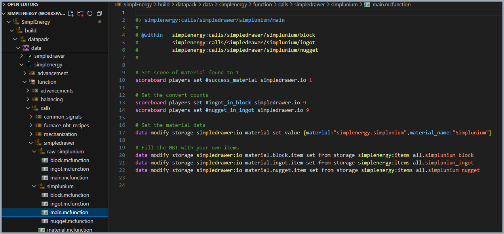

# 📦 stewbeet.plugins.compatibilities.simpledrawer

📄 **Source Code**: [`stewbeet/plugins/compatibilities/simpledrawer/__init__.py`](../../python_package/stewbeet/plugins/compatibilities/simpledrawer/__init__.py) 🔗

## 🔗 Dependencies
- **✅ Required**: `Your definition plugin` (see [`definitions_setup.md`](../definitions_setup.md) for details)
- **🔧 Optional**: SimpleDrawer datapack (external dependency)
- **📋 Material Structure**: Items must follow naming conventions (material_block, material_ingot, material_nugget)

## 📋 Overview
The `compatibilities.simpledrawer` plugin provides integration with the SimpleDrawer datapack's<br>
compacting drawer functionality. It automatically detects material blocks and their variants<br>
(ingots, nuggets) from your definitions and generates the necessary functions and data<br>
to enable automatic compacting/decompacting in SimpleDrawer's compacting drawers.

### <u>Some Features Showcase</u>

**Automatic compatibility with SimpleDrawer's compating drawer:**<br>


## 🎯 Purpose
- 🔗 Integrates custom materials with SimpleDrawer's compacting drawer system
- 🧱 Automatically detects material blocks and their variants (ingots, nuggets)
- ⚙️ Generates conversion ratio calculations for proper compacting
- 📊 Creates material data structures for SimpleDrawer compatibility
- 🔄 Handles both regular and raw material variants
- 🏷️ Sets up proper NBT data and storage for material identification

## ⚙️ Configuration

### 🎯 Basic Example Configuration
```yaml
pipeline:
  - ...
  - stewbeet.plugins.compatibilities.simpledrawer
  - ...

# No specific configuration required - automatically detects materials
# Works with existing material definitions that follow naming conventions
# Materials must have proper smithed.dict structure in custom_data (automatic if you used definitions helper functions)
```

### 📋 Configuration Options for item definitions

| Option | Type | Default | Description |
|--------|------|---------|-------------|
| `material_block` | string | Auto-detected | Material blocks ending with `_block` (e.g., `steel_block`) |
| `material_ingot` | string | Auto-detected | Material ingots (e.g., `steel_ingot`, `steel_fragment`) |
| `material_nugget` | string | Auto-detected | Material nuggets (e.g., `steel_nugget`) |
| `smithed.dict` | object | **Required** | Smithed convention structure in custom_data for material identification |

## ✨ Features

### 🔍 Material Detection and Variant Discovery
Automatically scans definitions for material blocks and identifies their variants:
- 🧱 Detects blocks ending with `_block` suffix
- 🏷️ Extracts material base from smithed.dict structure
- 🔄 Handles both regular materials and raw material variants
- 💎 Identifies ingot variants (base, _ingot, _fragment suffixes)
- ✨ Discovers nugget forms when available

### ⚙️ Conversion Ratio Calculation
Intelligently calculates conversion ratios between material variants:
- 📊 Analyzes crafting recipes to determine conversion rates
- 🔢 Supports both shaped and shapeless recipe patterns
- 🧱 Calculates ingots per block ratio (default: 9)
- ✨ Determines nuggets per ingot ratio (default: 9)
- 📋 Handles single-ingredient recipe detection

### 🔗 SimpleDrawer Integration
Creates the necessary function tags and data structures for mod integration:
- 🏷️ Links to SimpleDrawer's material function tag system
- 📦 Creates material detection functions with NBT checking
- 🎯 Sets up proper namespace and item identification
- ⚡ Optimizes with success flags to prevent redundant processing

### 📊 Material Data Structure Generation
Generates comprehensive material data for each detected material:
- 🏷️ Creates material identification with proper naming
- 🔢 Sets conversion ratios for ingots and nuggets
- 📦 Links item data from project storage
- 🎯 Organizes data by material type (block=0, ingot=1, nugget=2)
- ✅ Sets success flags for proper mod interaction

### 🔄 Variant-Specific Function Generation
Creates individual functions for each material variant:
- 📁 Organizes functions by material base name
- 🎯 Creates variant-specific entry points (block, ingot, nugget)
- 🔗 Links to main material processing function
- ⚙️ Sets appropriate type identifiers for SimpleDrawer 

