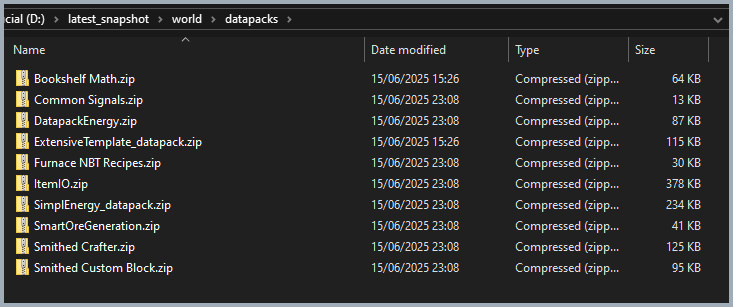

# 📂 stewbeet.plugins.copy_to_destination

📄 **Source Code**: [`stewbeet/plugins/copy_to_destination/__init__.py`](../../python_package/stewbeet/plugins/copy_to_destination/__init__.py) 🔗

## 🔗 Dependencies
- **✅ Required**: Generated pack archives from archive plugin
- **✅ Required**: Configured destination paths in project metadata
- **📍 Position**: Should run after archive and merge_smithed_weld plugins
- **🔧 Optional**: Custom libraries in libs folder
- **🔧 Optional**: Official libraries (copies only used ones)
- **📋 Related**: Works with output from archive and merge plugins

## 📋 Overview
The `copy_to_destination` plugin automatically copies generated packs to configured destinations.<br>
It handles copying datapacks, resource packs, library dependencies, and official libraries<br>
to multiple destination folders with intelligent merge detection, retry logic for permission<br>
handling, and proper directory structure management for development and testing workflows.

### <u>Some Features Showcase</u>

**Datapack and all dependencies are copied to destination**<br>


## 🎯 Purpose
- 📂 Copies generated packs to configured destination folders
- 🔗 Handles both individual datapacks and merged resource packs
- 📚 Automatically copies library dependencies and official libraries
- 🔄 Provides retry logic for handling permission errors
- 🎯 Supports multiple destinations for different environments
- 🛠️ Facilitates development workflows with automatic deployment

## ⚙️ Configuration

### 🎯 Basic Example Configuration
```yaml
pipeline:
  - ...
  - stewbeet.plugins.copy_to_destination

meta:
  stewbeet:
    build_copy_destinations:
      datapack:
        - "path/to/minecraft/saves/world/datapacks"
        - "path/to/development/datapacks"
      resource_pack:
        - "path/to/minecraft/resourcepacks"
        - "path/to/server/resourcepacks"
    libs_folder: "libs"  # Optional: custom libraries folder
```

### 📋 Configuration Options

| Option | Type | Default | Description |
|--------|------|---------|-------------|
| `build_copy_destinations` | object | `{}` | Configuration for copy destinations |
| `build_copy_destinations.datapack` | array | `[]` | List of datapack destination folders |
| `build_copy_destinations.resource_pack` | array | `[]` | List of resource pack destination folders |
| `libs_folder` | string | `"libs"` | Folder containing custom library archives |
| Retry Logic | automatic | 10 attempts | Maximum retry attempts for permission errors |

## ✨ Features

### 📦 Datapack Distribution System
Copies main datapacks and library dependencies to configured destinations:
- 📁 Copies main project datapack to all configured destinations
- 📚 Automatically includes all library datapacks from libs folder
- 🔍 Scans for `.zip` files in the libraries datapack directory
- ✅ Creates destination directories if they don't exist

### 🎨 Resource Pack Management
Handles resource pack copying with merge detection:
- 🔗 Prioritizes merged resource packs over individual ones
- 📦 Falls back to normal resource pack if merged version unavailable
- 🏷️ Preserves appropriate naming for merged vs normal packs
- 📁 Maintains proper file organization in destination folders

### 🏛️ Official Library Distribution
Copies used official libraries to datapack destinations:
- 📚 Only copies libraries marked as used in the project
- 🔍 Validates library existence before copying
- 📁 Organizes libraries in appropriate destination folders
- ✅ Provides informative logging for each copied library

### 🔄 Retry Logic System
Implements robust file copying with error handling:
- 🛡️ Handles permission errors with automatic retry logic
- ⏰ Uses configurable delay between retry attempts
- 🧹 Attempts to remove existing files before copying
- ⚠️ Provides warnings during retry attempts with clear messaging

### 📊 Smart Copy Detection
Intelligently determines which files to copy based on availability:
- 🔍 Checks for pack existence before attempting copies
- 📋 Skips operations when no destinations are configured
- 🎯 Validates project configuration requirements
- ✅ Provides early exit for efficiency when no work is needed 

