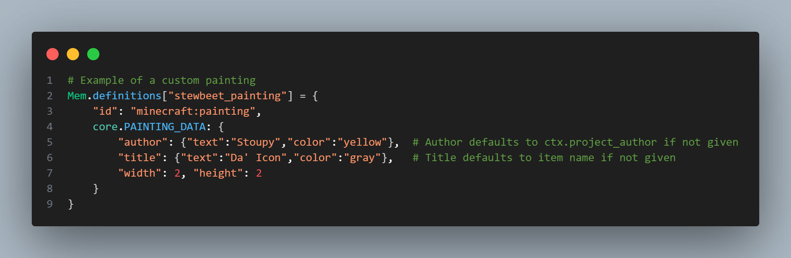
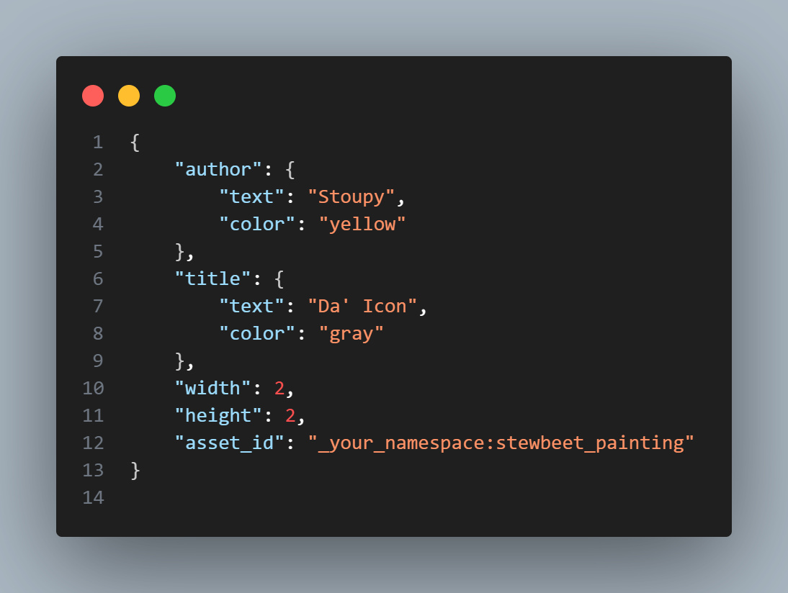
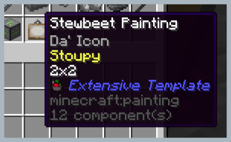
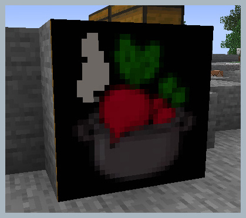

# 🖼️ stewbeet.plugins.custom_paintings

📄 **Source Code**: [`stewbeet/plugins/custom_paintings/__init__.py`](../../python_package/stewbeet/plugins/custom_paintings/__init__.py) 🔗<br>

## 🔗 Dependencies
- **✅ Required**: StewBeet framework initialization
- **✅ Required**: `Your definition plugin` (see [`definitions_setup.md`](../1_definitions_setup/README.md) for details)
- **✅ Required**: Texture file in the configured textures folder
- **📍 Position**: Should run anywhere between verify_definitions and ingame_manual<br>
(see [`basic/beet.yml`](../../templates/basic/beet.yml) for an example)

## 📋 Overview
The `custom_paintings` plugin generates custom paintings for datapacks and resource packs based on item definitions.<br>
It automatically creates painting variants, handles texture registration, and manages the placeable paintings tag system.<br>
**(This plugin requires valid item definitions in memory and corresponding texture files to function properly.)**

### <u>Feature Showcase</u>

**Item definition example ([source](../../templates/extensive/src/setup_definitions.py)):**<br>


**Generated variant file ([source](../../templates/extensive/build/datapack/data/_your_namespace/painting_variant/stewbeet_painting.json)):**<br>


**Item in inventory:**<br>


**Painting placed in a world:**<br>


## 🎯 Purpose
- 🛠️ **Custom Painting Generation** - Creates custom painting variants from item definitions
- 🎨 **Texture Management** - Automatically registers painting textures in resource pack
- 🏷️ **Metadata Handling** - Manages painting titles, authors, and dimensions
- 📦 **Tag System** - Generates placeable painting variant tags
- 🗂️ **Asset Organization** - Properly structures painting assets in the `textures/painting/` folder

## ⚙️ Configuration

### 🎯 Basic Example Configuration
```yaml
pipeline:
  - ...
  - src.setup_definitions  # Load item definitions into memory
  - stewbeet.plugins.verify_definitions
  - ...
  - stewbeet.plugins.custom_paintings  # Generate custom paintings
  - ...

meta:
  stewbeet:
    textures_folder: "assets/textures"  # Required: Path to texture files
```

### 📋 Configuration Requirements

| Setting | Type | Required | Description |
|---------|------|----------|-------------|
| `textures_folder` | string | ✅ Yes | Path to folder containing `.png` texture files for paintings |

## ✨ Features

### 🖼️ Painting Variant Generation
- **📝 Automatic Metadata** - Sets default author (from `project_author`) and title (from item name)
- **🔧 Custom Properties** - Supports width, height, and custom metadata
- **🏷️ Asset ID Management** - Automatically assigns `asset_id` as first property
- **🚫 Placeable Control** - Optional `not_placeable` flag to exclude from placement

### 🎨 Texture Processing
- **📁 Smart Discovery** - Automatically finds `.png` files matching item names
- **🔍 Path Resolution** - Searches recursively in textures folder
- **⚠️ Duplicate Detection** - Warns about multiple matching textures
- **� Resource Registration** - Places textures in `painting/` namespace
- **🎛️ Metadata Support** - Handles `.mcmeta` files for animated textures

### 🏷️ Tag Management
- **📋 Placeable Tag** - Automatically generates `minecraft:placeable` painting variant tag
- **🎯 Selective Inclusion** - Only includes paintings not marked as `not_placeable`
- **🔧 Namespace Organization** - Properly namespaces painting variant references

## 📝 Item Definition Structure

### 🎯 Basic Painting Definition
```python
# Example from setup_definitions.py
Mem.definitions["stewbeet_painting"] = {
    "id": "minecraft:painting",
    core.PAINTING_DATA: {
        "author": {"text":"Stoupy","color":"yellow"},  # Optional: defaults to project_author
        "title": {"text":"Da' Icon","color":"gray"},   # Optional: defaults to item name
        "width": 2,   # Required: painting width in blocks
        "height": 2   # Required: painting height in blocks
    }
}
```

### 🖼️ Advanced Configuration Options
```python
core.PAINTING_DATA: {
    "author": {"text": "Artist Name", "color": "gold"},     # Author text component
    "title": {"text": "Painting Title", "color": "blue"},   # Title text component  
    "width": 1,                                             # Width in blocks (1-16)
    "height": 1,                                            # Height in blocks (1-16)
    "not_placeable": True                                   # Optional: exclude from placeable tag
}
```

## 📁 File Structure Example

### 🖼️ Texture Organization
```
assets/textures/
├── stewbeet_painting.png          # Main painting texture
├── subfolder/
│   ├── another_painting.png        # Another painting
│   └── another_painting.png.mcmeta # Optional animation metadata
└── ...
```

### 📦 Generated Files
```
# Datapack
data/your_namespace/painting_variant/
├── stewbeet_painting.json          # Painting variant definition
└── another_painting.json

data/minecraft/painting_variant_tag/
└── placeable.json                  # Tag containing all placeable paintings

# Resource Pack  
assets/your_namespace/textures/painting/
├── stewbeet_painting.png           # Registered painting texture
├── another_painting.png
└── another_painting.png.mcmeta
```

