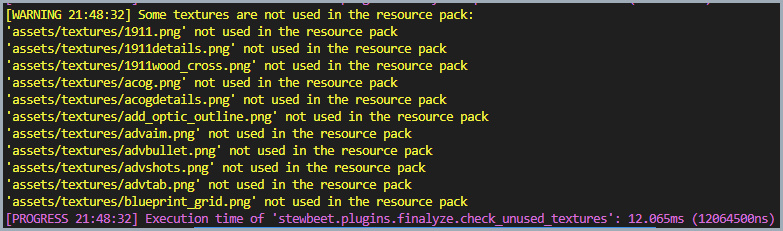

# 🔍 stewbeet.plugins.finalyze.check_unused_textures

📄 **Source Code**: [`stewbeet/plugins/finalyze/check_unused_textures/__init__.py`](../../python_package/stewbeet/plugins/finalyze/check_unused_textures/__init__.py) 🔗

## 🔗 Dependencies
- **✅ Required**: `meta.stewbeet.textures_folder` configuration
- **✅ Required**: Beet context with resource pack assets
- **📍 Position**: Must run after all texture-generating plugins
- **📋 Related**: Works with any plugins that generate textures

## 📋 Overview
The `finalyze.check_unused_textures` plugin analyzes texture usage in resource packs.<br>
It scans all PNG files in the textures folder, compares them with texture references<br>
in the generated resource pack, and provides warnings for unused texture files<br>
to help optimize resource pack size and identify orphaned assets.

### <u>Feature Showcase</u>

**Warning message in terminal:**<br>


## 🎯 Purpose
- 🔍 Identifies unused texture files in the resource pack
- 📊 Analyzes texture references across all generated assets
- ⚠️ Provides warnings for orphaned texture files
- 🗂️ Helps optimize resource pack size by finding unused assets
- 📝 Generates detailed reports of unused texture paths
- 🧹 Assists in resource pack cleanup and maintenance

## ⚙️ Configuration

### 🎯 Basic Example Configuration
```yaml
pipeline:
  - ...
  - stewbeet.plugins.finalyze.check_unused_textures  # Should run after all texture-generating plugins
  - ...

meta:
  stewbeet:
    textures_folder: "assets/textures"  # Required: path to textures folder
```

### 📋 Configuration Options

| Option | Type | Default | Description |
|--------|------|---------|-------------|
| `textures_folder` | string | **Required** | Path to the folder containing PNG texture files |
| Warning Output | automatic | Enabled | Shows warnings for unused textures in console |
| File Extension | constant | `.png` | Only PNG files are analyzed for texture usage |
| Path Comparison | automatic | Relative | Compares relative paths from textures folder |

## ✨ Features

### 🔍 Texture Discovery System
Scans the textures folder for all PNG files:
- 📁 Recursively searches the configured textures folder
- 🖼️ Identifies all PNG files using glob pattern `*.png`
- 📍 Calculates relative paths from the textures folder root
- 📊 Builds comprehensive texture inventory for analysis

### 📊 Usage Analysis Engine
Compares texture files with resource pack references:
- 🔗 Checks each texture against `ctx.assets.textures` collection
- 🎯 Handles both Texture objects and string references
- ✂️ Removes file extensions for accurate path matching
- 🔍 Uses `endswith()` matching for flexible path comparison

### ⚠️ Unused Texture Detection
Identifies orphaned texture files not referenced in the pack:
- 🚫 Detects textures with no matching references in the resource pack
- 📝 Collects unused texture paths in a dedicated set
- 🎯 Supports both direct texture objects and string path references
- ✅ Ensures accurate detection through comprehensive path matching

### 📋 Warning Report Generation
Provides detailed warnings for unused textures:
- 📊 Sorts unused texture paths alphabetically for organized output
- 📍 Shows complete file paths relative to textures folder
- ⚠️ Generates multi-line warning messages with clear formatting
- 🎨 Uses structured warning format for easy identification

