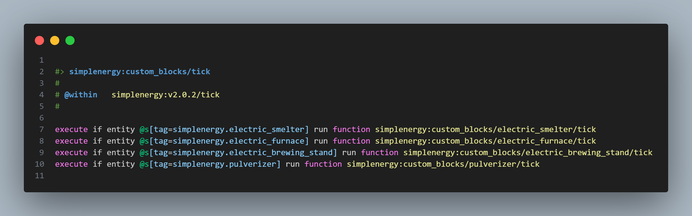

# ⏰ stewbeet.plugins.finalyze.custom_blocks_ticking

📄 **Source Code**: [`stewbeet/plugins/finalyze/custom_blocks_ticking/__init__.py`](../../python_package/stewbeet/plugins/finalyze/custom_blocks_ticking/__init__.py) 🔗

## 🔗 Dependencies
- **✅ Required**: Custom block functions in the `custom_blocks/` folder
- **🔧 Optional**: Custom blocks with `block_name/tick.mcfunction` or `block_name/second.mcfunction` files
- **📋 Related**: Works with `datapack.custom_blocks` plugin for block infrastructure

## 📋 Overview
The `finalyze.custom_blocks_ticking` plugin automatically sets up ticking functionality<br>
for custom blocks by detecting timing functions in the custom_blocks folder.<br>
It generates the necessary infrastructure to call these functions efficiently, including<br>
entity tagging, scoreboard optimization, and proper integration with versioned functions.<br>
Supports multiple timing intervals: `tick`, `tick_2`, `second`, `second_5`, and `minute`.

### <u>Some Features Showcase</u>

**Automatically links custom blocks timing functions efficiently:**<br>


## 🎯 Purpose
- ⏰ Automatically detects custom block timing functions (tick, tick_2, second, second_5, minute)
- 🏷️ Sets up entity tagging system for ticking custom blocks
- 📊 Implements scoreboard-based performance optimization
- 🔄 Integrates with versioned function system for proper timing
- ⚡ Provides efficient execution only when ticking entities exist
- 📈 Adds statistics tracking for ticking entities

## ⚙️ Configuration

### 🎯 Basic Example Configuration
```yaml
pipeline:
  - ...
  - stewbeet.plugins.datapack.custom_blocks  # Optional if you are adding custom blocks functions yourself
  - ...
  - stewbeet.plugins.finalyze.custom_blocks_ticking
  - ...
# No specific configuration required - automatically detects timing functions
# Create timing functions in custom_blocks folder:
# custom_blocks/{block_name}/tick.mcfunction       - Runs every tick (20 times/second)
# custom_blocks/{block_name}/tick_2.mcfunction     - Runs every 2 ticks (10 times/second)
# custom_blocks/{block_name}/second.mcfunction     - Runs every second
# custom_blocks/{block_name}/second_5.mcfunction   - Runs every 5 seconds
# custom_blocks/{block_name}/minute.mcfunction     - Runs every minute
```

When writing those functions from Python, take the path from the block rather than
retyping the convention — see [Resource Locations](../1_definitions_setup/en.md#-resource-locations):

```python
obj = Block.from_id("electric_furnace")
write_function(obj.functions.tick, "...")
write_function(obj.functions.second, "...")

# Or build the accessor directly from the block ID — same paths, and it works
# even for IDs that have no Block definition:
write_function(BlockFunctions("electric_furnace").tick, "...")
```

### 📋 Configuration Options

| Option                | Type      | Default       | Description                                                     |
| --------------------- | --------- | ------------- | --------------------------------------------------------------- |
| `tick.mcfunction`     | file      | Auto-detected | Custom block function that runs every tick (20 times/second)    |
| `tick_2.mcfunction`   | file      | Auto-detected | Custom block function that runs every 2 ticks (10 times/second) |
| `second.mcfunction`   | file      | Auto-detected | Custom block function that runs every second                    |
| `second_5.mcfunction` | file      | Auto-detected | Custom block function that runs every 5 seconds                 |
| `minute.mcfunction`   | file      | Auto-detected | Custom block function that runs every minute (60 seconds)       |
| Function Detection    | automatic | N/A           | Scans `custom_blocks/` folder for timing functions              |
| Entity Optimization   | automatic | Enabled       | Uses scoreboards to optimize execution when no entities exist   |

## ✨ Features

### 🔍 Automatic Function Detection
Scans the custom_blocks folder for timing functions:
- 📁 Searches for functions in `{namespace}:custom_blocks/{block}/` folder
- ⚡ Detects `tick.mcfunction` for every-tick execution (20 times/second)
- ⏱️ Detects `tick_2.mcfunction` for every 2 ticks execution (10 times/second)
- 🕐 Detects `second.mcfunction` for once-per-second execution
- ⏰ Detects `second_5.mcfunction` for every 5 seconds execution
- ⏲️ Detects `minute.mcfunction` for every minute execution
- 🎯 Validates proper folder structure and naming

### 🏷️ Entity Tagging System
Sets up proper entity tags for ticking custom blocks:
- 🔖 Adds tags during block placement (`place_secondary`)
- ⚡ Creates `{namespace}.tick` tags for tick-based execution
- 🔄 Creates `{namespace}.tick_2` tags for 2-tick intervals
- ⏰ Creates `{namespace}.second` tags for second-based ticking
- ⏱️ Creates `{namespace}.second_5` tags for 5-second intervals
- ⏲️ Creates `{namespace}.minute` tags for minute-based execution
- 🧹 Removes tags during block destruction to prevent memory leaks

### 📊 Performance Optimization
Implements scoreboard-based optimization for efficient execution:
- ⚡ Tracks `#tick_entities` count for tick functions
- 🔄 Tracks `#tick_2_entities` count for 2-tick functions
- 🔢 Tracks `#second_entities` count for second functions
- ⏱️ Tracks `#second_5_entities` count for 5-second functions
- ⏲️ Tracks `#minute_entities` count for minute functions
- 🎯 Only executes when entities with tags exist
- ⚙️ Prevents unnecessary function calls when no ticking blocks are present

### 🔄 Versioned Function Integration
Integrates with the versioned function system for proper timing:
- ⚡ Adds to versioned `tick` function for every-tick execution
- 🔄 Adds to versioned `tick_2` function for 2-tick execution
- ⏰ Adds to versioned `second` function for once-per-second execution
- ⏱️ Adds to versioned `second_5` function for 5-second execution
- ⏲️ Adds to versioned `minute` function for every-minute execution
- 🎯 Uses scoreboard checks to optimize performance
- 📋 Proper integration with existing timing infrastructure

### 🌐 Custom Block Function Distribution
Creates centralized distribution functions for multiple custom blocks:
- ⚡ Generates `{namespace}:custom_blocks/tick` distribution function
- 🔄 Creates `{namespace}:custom_blocks/tick_2` distribution function
- 📦 Generates `{namespace}:custom_blocks/second` distribution function
- ⏱️ Creates `{namespace}:custom_blocks/second_5` distribution function
- ⏲️ Generates `{namespace}:custom_blocks/minute` distribution function
- 🏷️ Uses entity tags to route to specific block functions
- 🔄 Allows multiple custom blocks to have ticking functionality

### 📈 Statistics Integration
Adds ticking entity statistics to the stats system:
- 📊 Initializes scoreboard values for statistics
- ⚡ Reports count of entities with tick tags
- 🔄 Reports count of entities with tick_2 tags
- 📈 Reports count of entities with second tags
- ⏱️ Reports count of entities with second_5 tags
- ⏲️ Reports count of entities with minute tags
- 🎯 Integrates with existing `_stats_custom_blocks` system 

