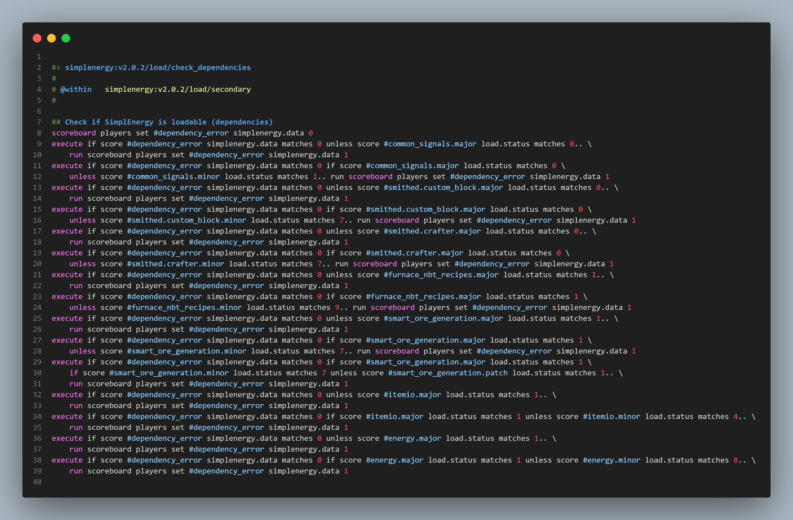
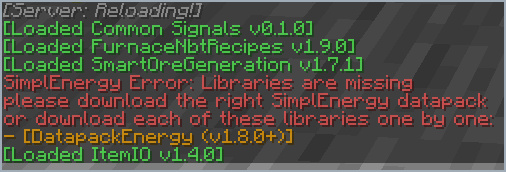

# 📋 stewbeet.plugins.finalyze.dependencies

📄 **Source Code**: [`stewbeet/plugins/finalyze/dependencies/__init__.py`](../../python_package/stewbeet/plugins/finalyze/dependencies/__init__.py) 🔗<br>
📄 **Full Guide**: [docs/5_dependencies/](../5_dependencies/en.md) 🔗

## 🔗 Dependencies
- **✅ Required**: Project ID, version, name, and author in context
- **✅ Required**: `stewbeet.plugins.datapack.loading` must run before
- **🔧 Optional**: Official libraries (auto-detected from function usage)
- **🔧 Optional**: Custom `load_dependencies` in metadata (see configuration below)
- **📍 Position**: Must run **after** all user functions have been written (scans them for library usage)
- **📋 Related**: Integrates with Lantern Load system

## 📋 Overview
The `finalyze.dependencies` plugin manages datapack dependencies and load sequence.<br>
It automatically detects official library usage by scanning all functions, downloads libraries<br>
via beet's content-addressed cache, sets up Lantern Load integration, and generates<br>
runtime version-checking mcfunctions with user-friendly clickable error messages.

### <u>Some Features Showcase</u>

**Creates a dependencies check function and later use it:**<br>


**Errors in chat when loading if missing dependencies:**<br>


## 🎯 Purpose
- 📦 Auto-detect and download official libraries used in functions — no manual config required (only optional)
- 🔍 Detect Bookshelf modules via `#bs.X:` tag patterns and modrinth/smithed libs via namespace
- ✅ Generate runtime scoreboard version checks for all dependencies
- 🔗 Integrate with Lantern Load for correct dependency loading order
- 🎮 Validate Minecraft version compatibility using `DataVersion` from `mc_supports`
- 📢 Provide clickable in-game error messages linking to each missing library
- ⚡ Wire `smart_ore_generation` signal function tags automatically

## ⚙️ Configuration

### 🎯 Basic Example Configuration
```yaml
pipeline:
  - ...
  - stewbeet.plugins.finalyze.dependencies  # Must run after all functions are written
  - ...

# Official libraries are auto-detected — no manual config required (only optional).
# Declare custom dependencies to auto-download and version-check at runtime:
meta:
  stewbeet:
    mc_supports: ["1.21.4", "1.21.5"]  # Optional: minimum is used for DataVersion check
    load_dependencies:

      # Smithed API — latest MC-compatible version auto-fetched
      "smithed.crafter":
        name: "Smithed Crafter"
        url: "https://wiki.smithed.dev/libraries/crafter/"
        source: "smithed"
        smithed_id: "crafter"
        has_resource_pack: true  # optional, default false

      # Modrinth API — latest release for the current MC version auto-fetched
      "itemio":
        name: "ItemIO"
        url: "https://github.com/edayot/ItemIO"
        source: "modrinth"
        modrinth_slug: "itemio"

      # Static URL — version pinned, zip downloaded per MC version
      "common_signals":
        version: [0, 2, 0]
        name: "Common Signals"
        url: "https://github.com/Stoupy51/CommonSignals"
        source: "static"
        static_urls:
          "((1, 21, 7), (0, 2, 0))": "https://github.com/Stoupy51/CommonSignals/releases/download/v0.2.0/CommonSignals_datapack.zip"
```

### 📋 Configuration Options

| Option | Type | Default | Description |
|--------|------|---------|-------------|
| `load_dependencies` | object | `{}` | Custom dependencies to download and version-check at runtime |
| `mc_supports` | list | `[]` | Supported MC versions; minimum determines the `DataVersion` compatibility check |
| Official library detection | automatic | Enabled | Scans all functions for known library namespaces and `#bs.X:` Bookshelf tags |
| Version checking | automatic | Enabled | Generates `check_dependencies` and `valid_dependencies` mcfunctions |

### 📋 `load_dependencies` Entry Fields

| Field | Required | Description |
|-------|----------|-------------|
| `name` | ✅ | Display name shown in runtime error messages |
| `url` | ✅ | Clickable link shown when the dependency is missing |
| `source` | ✅ | Download method: `"smithed"`, `"modrinth"`, or `"static"` |
| `smithed_id` | Smithed only | Smithed pack ID used to query the API |
| `has_resource_pack` | Smithed only | Also download the resource pack (default: `false`) |
| `modrinth_slug` | Modrinth only | Modrinth project slug used to query the API |
| `static_urls` | Static only | Maps `"((mc_ver), (dep_ver))"` keys to download URLs |
| `version` | Static only | Resolved automatically from `static_urls` at build time |

## ✨ Features

### 🔍 Automatic Library Detection
Scans all datapack functions during build:
- 📚 Detects Bookshelf module usage via `#bs.X:` tag call patterns
- 📦 Identifies `furnace_nbt_recipes`, `common_signals`, `itemio`, `smithed.actionbar`, `realistic_explosion` by namespace
- 🏷️ Marks detected libraries as `is_used = True` and triggers download via `get_lib_paths()`
- 📢 Logs a debug summary of all newly found libraries

### 🔗 Lantern Load Integration
Sets up proper loading infrastructure:
- 🏷️ Wires `minecraft:load` -> `#load:_private/load` -> init / pre_load / load / post_load phases
- 📋 Resets `load.status` scoreboard in `load:_private/init`
- ⚙️ Creates `#ns:load` -> `[#ns:enumerate, #ns:resolve]` chain
- 🔗 Prepends `#ns:dependencies` tag listing `#dep:load` for every dependency (deduped)

### ✅ Runtime Version Validation
Generates two mcfunctions that run at world load:
- 🔢 `check_dependencies` — sets `#dependency_error ns.data` flag by checking `#dep.major/minor/patch load.status` scores; uses `$bs` prefix for Bookshelf modules
- 🎮 `valid_dependencies` — waits for a player entity, reads `DataVersion` to detect Minecraft version, compares against minimum from `mc_supports`
- 📢 On failure: `tellraw @a` gold clickable links to each missing library (name, version, URL)
- ✅ `confirm_load` is only called when both `#mcload_error` and `#dependency_error` are 0

### ⚡ Smart Ore Generation Integration
Special automatic wiring for `smart_ore_generation`:
- 🔗 Connects `calls/smart_ore_generation/generate_ores`, `denied_dimensions`, and `post_generation` functions to the corresponding `smart_ore_generation:v1/signals/` function tags
- 🎯 Only activates when `smart_ore_generation` is detected as used 

