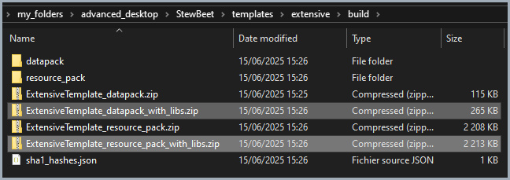
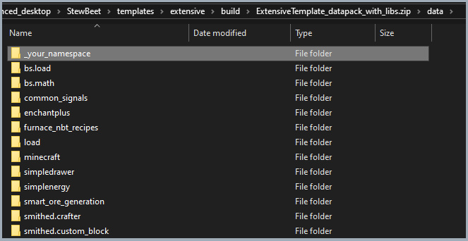

# 🔗 stewbeet.plugins.merge_smithed_weld

📄 **Source Code**: [`stewbeet/plugins/merge_smithed_weld/__init__.py`](../../python_package/stewbeet/plugins/merge_smithed_weld/__init__.py) 🔗<br>
📄 **Source Code**: [`stewbeet/plugins/merge_smithed_weld/weld.py`](../../python_package/stewbeet/plugins/merge_smithed_weld/weld.py) 🔗<br>

## 🔗 Dependencies
- **✅ Required**: Generated base archives from archive plugin
- **✅ Required**: Configured output directory and project name
- **🔧 Optional**: Custom libraries in configured libs folder
- **🔧 Optional**: Official libraries (automatically detected from usage)
- **📍 Position**: Must run after archive plugin creates base zip files

## 📋 Overview
The `merge_smithed_weld` plugin merges generated datapacks and resource packs with their dependencies.<br>
It uses Smithed Weld to combine project archives with library dependencies, official libraries,<br>
and custom libraries into unified distribution packages with proper metadata handling,<br>
consistent timestamps, and optimized compression for production deployment.

### <u>Some Features Showcase</u>

**Output directory will get both datapack and resource pack zipped**<br>


**We can see inside the datapack all namespaces**<br>


## 🎯 Purpose
- 🔗 Merges project packs with library dependencies using Smithed Weld
- 📦 Combines custom libraries from configured libs folder
- 🏛️ Integrates used official libraries automatically
- 🛠️ Handles proper pack.mcmeta and pack.png preservation
- 🕐 Maintains consistent timestamps for reproducible builds
- 📋 Creates distribution-ready merged archives

## ⚙️ Configuration

### 🎯 Basic Example Configuration
```yaml
# Requires output and project name configuration
output: "build"
name: "My Project"

pipeline:
  - ...
  - stewbeet.plugins.merge_smithed_weld

meta:
  stewbeet:
    libs_folder: "libs"  # Optional: custom libraries folder
```

### 📋 Configuration Options

| Option | Type | Default | Description |
|--------|------|---------|-------------|
| `output` | string | **Required** | Directory containing base archives and destination for merged archives |
| `name` | string | **Required** | Project name used for archive naming |
| `libs_folder` | string | `"libs"` | Folder containing custom library archives (datapack/*.zip, resource_pack/*.zip) |
| Archive Naming | automatic | `{project}_with_libs.zip` | Naming pattern for merged archive outputs |

## ✨ Features

### 🔍 Archive Detection System
Automatically detects and validates base archives for merging:
- 📦 Looks for project datapack and resource pack archives
- ✅ Only processes packs when base archives exist
- 🏷️ Uses sanitized project names for consistent file naming
- 📁 Ensures output directory structure is properly created

### 🔗 Smithed Weld Integration
Uses Smithed Weld CLI for professional pack merging:
- ⚡ Leverages Smithed's battle-tested merging algorithms
- 🛡️ Handles conflict resolution and dependency management
- 🔧 Configures error-only logging for clean output
- 📊 Creates temporary files for safe processing

### 🏛️ Official Library Integration
Automatically includes used official libraries in merged packs:
- 📚 Reads from OFFICIAL_LIBS registry for available libraries
- ✅ Only includes libraries marked as used in the project
- 📁 Supports separate datapack and resource pack library paths
- 🔍 Validates library existence before inclusion

### 📦 Custom Library Support
Integrates custom libraries from configured folders:
- 📁 Scans configured libs_folder for datapack and resource pack archives
- 🔍 Uses glob patterns to find all zip files in respective folders
- 🎯 Supports organized library structure with separate pack types
- ✅ Gracefully handles missing or empty library folders

### 🛠️ Metadata Preservation System
Ensures proper pack.mcmeta and pack.png handling:
- 🔄 Excludes conflicting metadata from merged libraries
- 📝 Uses project's original pack.mcmeta for final archive
- 🖼️ Preserves project's pack.png if available
- ✅ Ensures proper metadata precedence and consistency

### 🕐 Timestamp and Compression Management
Maintains consistent timestamps and optimal compression:
- ⏰ Uses get_consistent_timestamp for reproducible builds
- 🗜️ Applies ZIP_DEFLATED compression with level 6
- 📊 Creates proper ZipInfo objects for all entries
- 🧹 Cleans up temporary files after processing 

