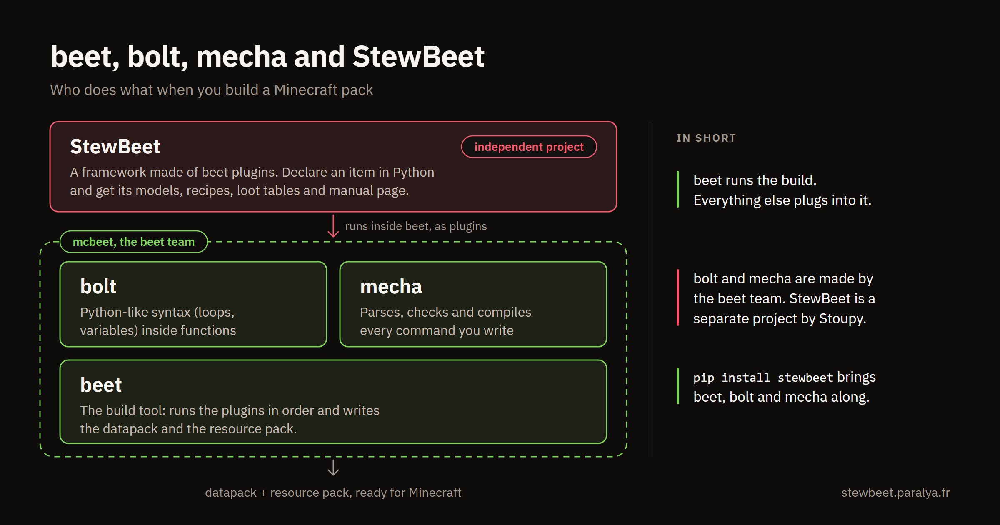

# Configuring the build

Every option of the beet configuration file, and what StewBeet does with it. The file is read at the start of every build and decides how the whole project is processed.

If beet, bolt and mecha are new names to you, this is who makes what:



The examples use YAML (`beet.yml`). Every option works the same in `beet.yaml`, `beet.json` or `pyproject.toml`. The file lives at the project root.

Complete files to read alongside this page:

- [extensive/beet.yml](https://github.com/Stoupy51/StewBeet/blob/main/templates/extensive/beet.yml), the template that uses every feature
- [SimplEnergy/beet.yml](https://github.com/Stoupy51/SimplEnergy/blob/main/beet.yml), a published pack
- [LifeSteal/beet.yml](https://github.com/Stoupy51/LifeSteal/blob/main/beet.yml), a published pack

## Project identity

### `id`

The namespace root of generated functions, tags and storage keys. Lowercase and underscores only.

```yaml
id: "_your_namespace"
```

### `name`

The human-readable name, shown in `pack.mcmeta`, item lore and in-game messages.

```yaml
name: "Extensive Template"
```

### `author`

One or more creators, shown in `pack.mcmeta`. Separate several names with `", "`.

```yaml
author: "Stoupy51"
author: "Player1, Player2, Player3"  # Multiple authors
```

Players whose in-game name matches an author automatically receive the `convention.debug` tag, which unlocks development tools.

### `version`

Semantic version (`major.minor.patch`), used for dependency checks and versioned function paths.

```yaml
version: "3.0.0"
```

### `minecraft`

The target game version, which decides the available commands and resource formats. Omit it to target the latest version.

```yaml
minecraft: "1.21.11"
```

## Directories

### `directory` and `output`

`directory` is the base for relative paths. `output` is where the built packs are written.

```yaml
directory: "."
output: "build"
```

### `ignore`

Files and patterns `beet watch` ignores, which prevents rebuild loops and speeds up watching.

```yaml
ignore: ["build", "manual_cache", "definitions_debug.json"]
```

## `require`

Python packages imported before the build, which makes their plugins available to the pipeline.

```yaml
require:
    - "stewbeet"
    - "bolt"
```

| Package | Role |
|---------|------|
| `stewbeet` | The framework (required) |
| `bolt` | Python-like syntax inside functions |
| `beet.contrib.vanilla` | Vanilla data generators |
| `mecha` | Command compiler (usually loaded automatically) |

## Packs

### `data_pack`

Loads `.mcfunction` and JSON files from `src/data/your_namespace/` into the datapack.

```yaml
data_pack:
    name: "datapack"
    load: ["src"]
```

### `resource_pack`

Loads assets from `src/assets/` into the resource pack.

```yaml
resource_pack:
    name: "resource_pack"
    load: ["src"]
```

## `pipeline`

The plugins that run after the packs are loaded, in order. Each one works on the result of the previous one:

```yaml
pipeline:
    - "src.setup_definitions"                              # User setup code
    - "stewbeet.plugins.resource_pack.sounds"              # Process custom sounds
    - "stewbeet.plugins.resource_pack.item_models"         # Generate item models
    - "stewbeet.plugins.resource_pack.check_power_of_2"    # Validate texture dimensions
    - "stewbeet.plugins.custom_recipes"                    # Generate custom recipes
    - "stewbeet.plugins.custom_paintings"                  # Process custom paintings
    - "stewbeet.plugins.ingame_manual"                     # Generate in-game manual
    - "stewbeet.plugins.datapack.loading"                  # Setup datapack loading
    - "stewbeet.plugins.datapack.custom_blocks"            # Process custom blocks
    - "stewbeet.plugins.datapack.loot_tables"              # Generate loot tables
    - "stewbeet.plugins.datapack.sorters"                  # Setup item sorters
    - "stewbeet.plugins.compatibilities.simpledrawer"      # SimpleDrawer compatibility
    - "stewbeet.plugins.compatibilities.neo_enchant"       # NeoEnchant compatibility
    - "src.link"                                           # User linking code
    - "mecha"                                              # Mecha paired with Bolt
    - "stewbeet.plugins.finalyze.custom_blocks_ticking"    # Setup block ticking
    - "stewbeet.plugins.finalyze.basic_datapack_structure" # Create basic structure
    - "stewbeet.plugins.finalyze.dependencies"             # Handle dependencies
    - "stewbeet.plugins.finalyze.check_unused_textures"    # Find unused textures
    - "stewbeet.plugins.finalyze.last_final"               # Final cleanup
    - "stewbeet.plugins.auto.lang_file"                    # Auto-generate lang files
    - "stewbeet.plugins.auto.text_renders"                 # Turn "render" keys into item glyphs
    - "stewbeet.plugins.auto.headers"                      # Add file headers
    - "stewbeet.plugins.archive"                           # Create ZIP archives
    - "stewbeet.plugins.merge_smithed_weld.datapack"       # Merge Smithed Weld libs into the datapack
    - "stewbeet.plugins.merge_smithed_weld.resource_pack"  # Merge Smithed Weld libs into the resource pack
    - "stewbeet.plugins.copy_to_destination"               # Copy to game folders
    - "stewbeet.plugins.compute_sha1"                      # Compute file hashes
```

The order follows eight phases:

| Phase | Plugins | What happens |
|-------|---------|--------------|
| 1. Setup | `src.setup_definitions` | Your code declares items, blocks and recipes |
| 2. Resource pack | `resource_pack.sounds`, `resource_pack.item_models`, `resource_pack.check_power_of_2` | Models and sounds are generated |
| 3. Content | `custom_recipes`, `custom_paintings`, `ingame_manual` | Recipes, paintings and the manual |
| 4. Datapack core | `datapack.loading`, `datapack.custom_blocks`, `datapack.loot_tables` | Loading, blocks, loot tables |
| 5. User code | `src.link` | Your functions, which can use everything above |
| 6. Compilation | `mecha` | Bolt and mecha compile every function |
| 7. Finalisation | `finalyze.custom_blocks_ticking`, `finalyze.basic_datapack_structure`, `finalyze.dependencies` | Clock functions and dependency checks |
| 8. Packaging | `auto.lang_file`, `auto.text_renders`, `archive`, `copy_to_destination` | Lang file, archives, copies, hashes |

Keep the recommended order. Your code goes in `setup_definitions` and `link`, `mecha` comes after it, and the finalisation plugins are not optional: they write the clock functions and the dependency checks the rest relies on.

## `meta`

### `mc_supports`

The versions declared to Modrinth and Smithed on upload. `"infinite"` declares forward compatibility. It also sets the supported formats written to `pack.mcmeta`.

```yaml
mc_supports: ["1.21.11", "26.1-snapshot-1", "infinite"]
```

### `model_resolver`

Caches resolved item models in `.beet_cache/model_resolver/`, which makes rebuilds 80 to 90% faster.

```yaml
model_resolver:
    use_cache: true
```

### `mecha`

How commands are parsed and formatted during compilation.

```yaml
mecha:
    multiline: true
    formatting: preserve
```

`multiline: true` accepts commands split over several lines:

```mcfunction
execute
    as @a[scores={health=1..10}]
    at @s
    run function my_namespace:fn
```

`formatting: preserve` keeps your own formatting in the output.

## `meta.stewbeet`

### Source folders

Where StewBeet reads textures, sounds, jukebox records and libraries.

```yaml
stewbeet:
    textures_folder: "assets/textures"
    sounds_folder: "assets/sounds"
    records_folder: "assets/records"
    libs_folder: "libs"
    libs_exclude_patterns: []
```

### `build_copy_destinations`

Folders the packs are copied to after each build. Combined with `beet watch`, the game always has the latest build.

```yaml
build_copy_destinations:
    datapack: ["D:/latest_snapshot/world/datapacks"]
    resource_pack: ["D:/minecraft/snapshot/resourcepacks"]
```

### `source_lore` and `source_lore_color`

A line appended to the lore of every custom item. `"auto"` is the project icon and name, both drawn with the generated `{id}:tooltip` font.

```yaml
source_lore: "auto" # TextComponents format
source_lore_color: "auto" # "auto" | any color | false
```

`source_lore_color` sets that font's colour. `"auto"` takes the dominant colour of your `pack.png`, any Pillow colour forces it (`"#55FFFF"`, `"gold"`, `[85, 255, 255]`), and `false` keeps the packaged gold. An `assets/tooltip.png` placed next to `pack.png` replaces the character atlas entirely and is never recoloured.

A source lore is a plain text component, so it also accepts the `render` key of the [`auto.text_renders`](../plugins/auto.text_renders.md) plugin, to show an item image next to the project name:

```yaml
source_lore: [{"text":"ICON"}, " ", {"text":"My Pack", "color":"white", "italic":false, "font":"my_pack:tooltip"}, " ", {"render":"steel_ingot", "height":10}]
```

### `iso_renders_path` and `text_renders`

Where the per-item PNGs live, and how the `render` key of text components is drawn.

```yaml
iso_renders_path: "iso_renders"
text_renders:
    default_height: 16
    font: "renders"
    # allow_oversized: true   # unset asks once in the terminal, and remembers the answer
```

`iso_renders_path` holds one PNG per item, as `<folder>/<namespace>/<item>.png`. Project items are rendered from their model, `minecraft:` items are downloaded, and items from other packs are the ones you put there yourself. It is shared by [`ingame_manual`](../7_ingame_manual/en.md) and [`auto.text_renders`](../plugins/auto.text_renders.md), so an item is only rendered once.

A picture larger than the 256x256 that fits in one glyph is cut into a grid of glyphs joined with negative spacing, at the cost of one texture per tile. The first build that meets one asks in the terminal and remembers the answer in `.beet_cache`. `allow_oversized` answers up front, and `false` shrinks such renders to a single glyph.

> **Deprecated**: `manual.cache_path` is replaced by `iso_renders_path`. Projects that still set it keep working (renders are read from `<cache_path>/items`), and everything else the manual caches lives in beet's `.beet_cache` folder.

### `load_dependencies`

Datapacks checked when your pack loads. A missing or outdated one prints an error in chat with a download link.

```yaml
load_dependencies:
    "energy":
        version: [1, 8, 0]
        name: "DatapackEnergy"
        url: "https://github.com/ICY105/DatapackEnergy"
```

This only works with datapacks that follow the [LanternLoad](https://github.com/LanternMC/load) convention.

### `manual`

Rendering, caching, layout and interaction of the generated in-game manual.

```yaml
manual:
    debug_mode: false
    manual_overrides: "assets/manual_overrides"
    high_resolution: true
    cache_assets: true
    cache_pages: false
    name: ""
    max_items_per_row: 5
    max_rows_per_page: 5
    first_page_text: [{"text":"...", "color":"#505050"}]
    showcase_image: 3
    use_dialog: 1
```

| Option | Effect |
|--------|--------|
| `debug_mode` | `true` draws a grid overlay to debug the layout |
| `manual_overrides` | Folder of files that replace the default manual assets by name. See the [overridable assets](https://github.com/Stoupy51/StewBeet/tree/main/python_package/stewbeet/plugins/ingame_manual/assets) |
| `high_resolution` | Renders item images at high resolution |
| `cache_assets` | Caches Minecraft textures and models (about 90% faster builds) |
| `cache_pages` | Caches every page. Leave it `false` on small projects |
| `name` | Manual title. Empty means generated from the project name |
| `max_items_per_row` | Items per row, 1 to 6 |
| `max_rows_per_page` | Rows per page, 1 to 7. The default grid is 5x5, so 25 items a page |
| `first_page_text` | Welcome text, as text components |
| `showcase_image` | `0` off, `1` manual items only, `2` all custom items, `3` both (recommended) |
| `use_dialog` | `0` book only (no server restart needed), `1` book that opens a dialog (recommended, needs a server restart), `2` dialog only (needs a server restart) |

Generated glyph images are cached in beet's `.beet_cache` folder. Item renders live in `iso_renders_path`, above.

Example welcome text:

```yaml
first_page_text: [{"text":"The following manual will guide you through recipes and energy statistics about devices.", "color": "#505050"}]
```

## Minimal configuration

A beet project that only uses the `auto.headers` plugin:

```yaml
# Path to a folder for beet to output
output: "build"

# A list of importable plugin strings
require:
    - "bolt"

# Takes a nested pack config
data_pack:
    name: "datapack"
    load: ["src"]

pipeline:
    - "mecha"
    - "stewbeet.plugins.auto.headers"
```

## Glossary

| Term | Meaning |
|------|---------|
| **Beet configuration file** | The project config (`beet.yml`, `beet.yaml`, `beet.json` or `pyproject.toml`) loaded at the start of a build |
| **Pipeline** | The ordered list of plugins that transform and package the project |
| **Meta section** | The `meta` container for plugin settings, used by StewBeet and related tools |

## Next steps

- [All plugins](../plugins/README.md): what each pipeline stage does.
- [Using datapack libraries](../5_dependencies/en.md): declare and auto-download dependencies.
- [Shipping releases](../6_continuous_delivery/en.md): publish the pack the pipeline builds.

Questions go to the [Discord community](https://discord.gg/anxzu6rA9F).
