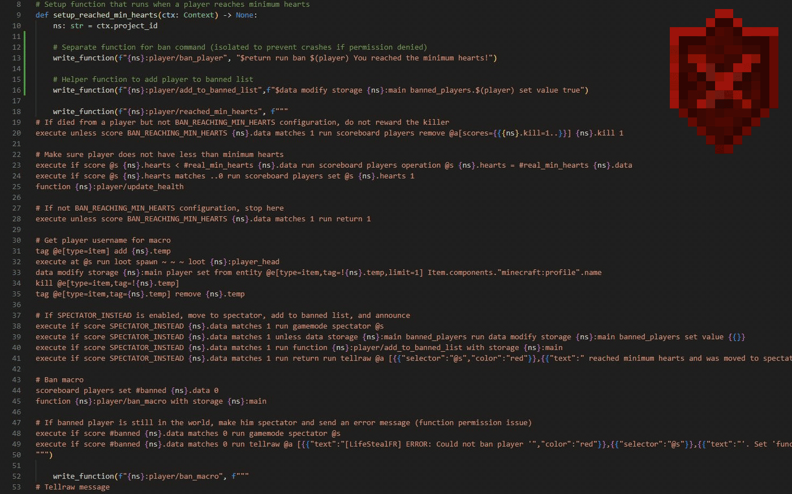

# StewBeet mcfunction Syntax

> Syntax highlighting and block decorations for **mcfunction** code embedded inside [StewBeet](https://github.com/Stoupy51/StewBeet) `write_*` Python calls.

Comparison without and with the extension:



---

## Features

### Syntax highlighting
Triple-quoted and single-line strings passed to the following functions are highlighted as mcfunction:

| Function                                           | Content argument |
| -------------------------------------------------- | ---------------- |
| `write_function(path, content, ...)`               | 2nd              |
| `write_versioned_function(path, content, ...)`     | 2nd              |
| `write_scheduled_function(duration, content, ...)` | 2nd              |
| `write_load_file(content, ...)`                    | 1st              |
| `write_unload_file(content, ...)`                  | 1st              |
| `write_tick_file(content, ...)`                    | 1st              |

All string forms are supported: `"""..."""`, `'''...'''`, `"..."`, `'...'`, and their `f`-string variants.  
Python interpolations (`{variable}`) inside f-strings are parsed correctly and never mistaken for mcfunction syntax.

### Block decorations
Multi-line strings are wrapped in a unified colored rectangle. Single-line strings get an inline border that starts exactly at the quote character.

---

## Configuration

All settings are under `StewBeetMCfunction.*` in your `settings.json`:

| Setting | Default | Description |
|---|---|---|
| `enabled` | `true` | Toggle block decorations on/off |
| `backgroundColor` | `rgba(80,40,0,0.15)` | Background fill color |
| `borderColor` | `rgba(200,120,30,0.30)` | Border color |
| `borderWidth` | `"2px"` | Border thickness |

Example customization:
```jsonc
// settings.json
"StewBeetMCfunction.backgroundColor": "rgba(0,60,30,0.15)",
"StewBeetMCfunction.borderColor": "rgba(80,200,100,0.40)",
"StewBeetMCfunction.borderWidth": "1px"
```

---

## Grammar

mcfunction grammar from [Arcensoth/language-mcfunction](https://github.com/Arcensoth/language-mcfunction), bundled via [StewBeet](https://github.com/Stoupy51/StewBeet/blob/main/docs/web/src/langs/mcfunction.tmLanguage.json).

---

## Installation

**From the marketplace:** search *StewBeet mcfunction Syntax* in the Extensions panel.

**From a `.vsix` file:**
```bash
code --install-extension stewbeet-mcfunction-syntax-2.0.0.vsix
```
Or: **Extensions → `...` → Install from VSIX...**
